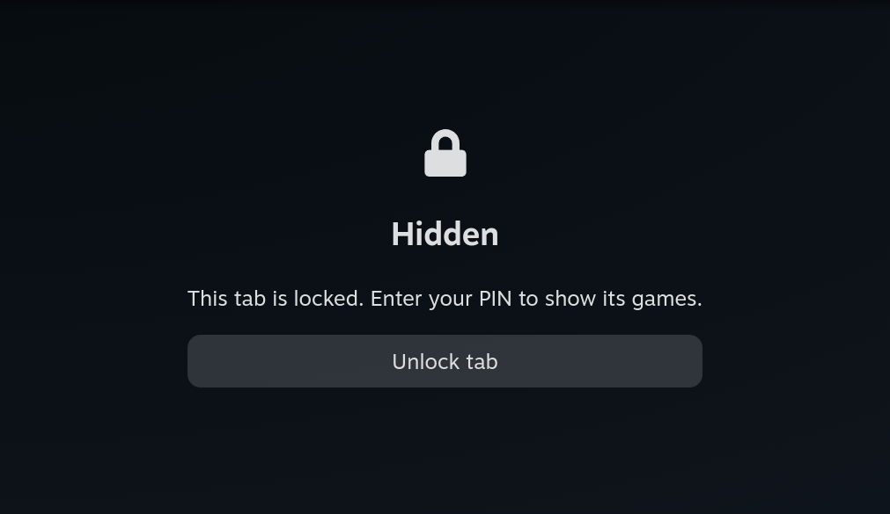
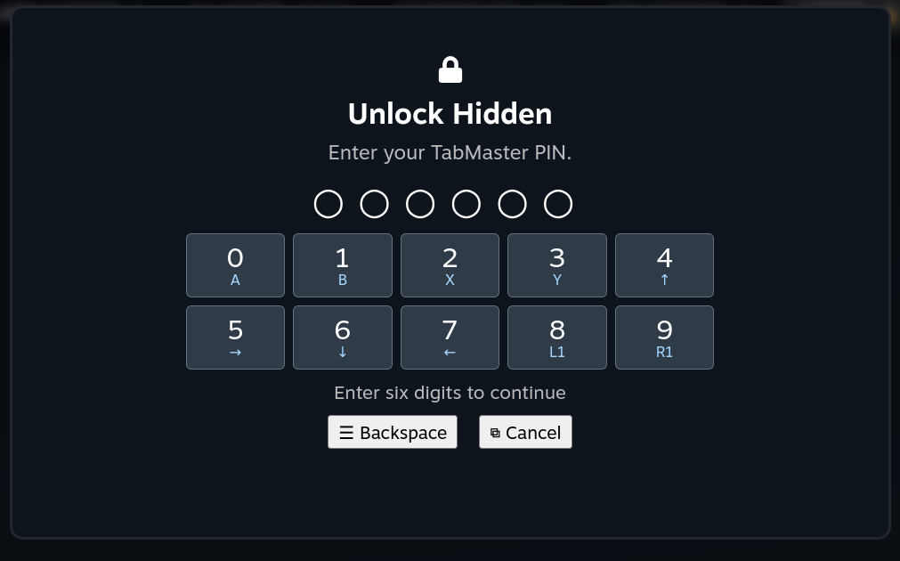

# TabMaster Lock

PIN-protected library tabs for Steam Deck. A fork of [TabMaster](https://github.com/Tormak9970/TabMaster) that keeps its tab customization and adds a separate six-digit plugin PIN.

[Download v0.1.0](https://github.com/ChronoStriker1/TabMaster-Lock/releases/tag/v0.1.0) · [Report an issue](https://github.com/ChronoStriker1/TabMaster-Lock/issues) · [Testing status](docs/DEVICE-TESTING.md)

> This protects content **inside selected tabs only**. Games remain visible in other tabs, Home, and search. It is a privacy feature, not a Steam-wide game lock.

## See it in action

**Protected tab:** game tiles and the game count stay hidden until you unlock it.



**Unlock prompt:** enter your separate six-digit plugin PIN using the displayed controller mappings, touchscreen, or keyboard.



These screenshots show the actual plugin on a Steam Deck. No games or entered PIN digits are visible; the account header is excluded.

## Install from GitHub

You need [Decky Loader installed](https://github.com/SteamDeckHomebrew/decky-loader#installation). TabMaster Lock is an experimental GitHub release; the original TabMaster store download does not include these lock features.

**Already using TabMaster?** Back up its settings and disable it before enabling this fork. Both plugins modify the same Library screen and must not run together. Use TabMaster's backup/restore controls to transfer your tabs; the fork uses a separate settings directory.

### Option 1: Paste the release URL into Decky

1. In Gaming Mode, press **…**, open **Decky** (the plug icon), and open its **Settings** (gear icon).
2. Under **General**, enable **Developer mode**, then open **Developer**.
3. Find **Install Plugin from URL** and paste this direct ZIP link:

   ```text
   https://github.com/ChronoStriker1/TabMaster-Lock/releases/download/v0.1.0/TabMaster-Lock_v0.1.0.zip
   ```

4. Select **Install** and confirm the installation prompt.
5. Open **TabMaster Lock** in Decky. Leave and reopen Library if it was already open.

Use the ZIP asset URL above—not the repository's `.git` URL, its web page, or GitHub's **Source code (zip)** download. Decky's installer needs the built plugin archive. See [Decky's installation options](https://github.com/SteamDeckHomebrew/decky-loader#getting-started).

### Option 2: Download the ZIP first

1. In Desktop Mode, open the [v0.1.0 release](https://github.com/ChronoStriker1/TabMaster-Lock/releases/tag/v0.1.0).
2. Under **Assets**, download **TabMaster-Lock_v0.1.0.zip**. Do not extract it.
3. Return to Gaming Mode and enable Decky's Developer mode as above.
4. Open **Decky Settings → Developer → Install Plugin from ZIP File**, choose the downloaded ZIP, and confirm.

For future updates, check this fork's [releases](https://github.com/ChronoStriker1/TabMaster-Lock/releases) and install the new plugin ZIP. Do not replace it with an upstream TabMaster release if you want to keep the lock feature.

## Add a lock to a tab

1. In Gaming Mode, press the Steam Deck's **…** button and select the **Decky** plug icon.
2. Open **TabMaster Lock** and scroll to the **Tabs** list.
3. Find the tab you want to protect—for example, **Hidden**—and select the **…** options button beside its name.
4. Select **Protect with PIN**.
5. If this is your first protected tab, choose a **six-digit plugin PIN**, then enter it again to confirm. If you already have a plugin PIN for this Steam account, enter that PIN to protect the additional tab.
6. Close Decky and visit the tab in **Library**. It should show a lock screen and **Unlock tab** instead of its games.

The PIN is **separate from your Steam Deck unlock PIN**. Naming a tab “Hidden” or hiding a tab in TabMaster does not automatically protect it: you must select **Protect with PIN** for each tab you want to lock. You can also access that action through the tab's Library options menu.

If the menu already shows **Unlock with PIN** or **Lock tab now**, that tab already has protection enabled. To undo it, choose **Remove PIN protection** and enter your current plugin PIN.

### Unlock and check automatic relocking

1. Visit the protected tab and select **Unlock tab**.
2. Enter your plugin PIN to reveal its games.
3. Switch to another tab or leave Library, then return. The tab should be locked again and ask for the PIN.

One PIN is used per Steam account, but each protected tab unlocks independently. Custom and built-in tabs can be protected. While locked, a tab's game grid, count, and edit/duplicate/snapshot actions are unavailable.

The PIN screen displays each digit's controller mapping. **Menu/Start** erases a digit; **View/Select** cancels. Keyboard users can type digits and use **Backspace** or **Escape**. This is a custom screen with its own mappings, not Steam's device PIN screen.

### Manage protection

- **Lock tab now** relocks one tab; **Lock all protected tabs** in Decky relocks them all.
- **Change PIN** requires the current PIN and relocks every protected tab.
- Removing protection also requires the current PIN, even if the tab is already unlocked.
- Tabs also relock on plugin reload, Steam account changes, suspend/resume, and activation of Steam's device lock screen.
- A duplicated tab is independent and starts unprotected. Ordinary tab backups do not export PIN protection.

## Limitations and recovery

**Experimental:** tested with Decky 3.2.8. Tab locking, wrong/correct PIN handling, restart persistence, automatic relocking on tab exit, and menu layout have been exercised on a Steam Deck. Physical controller input and actual suspend/resume still need acceptance testing. See the [device test report](docs/DEVICE-TESTING.md).

Disabling Decky or this plugin bypasses protection. Games are not encrypted or prevented from launching elsewhere. Steam updates can break the private UI hooks inherited from TabMaster.

**PIN storage:** only a random salt and scrypt verifier are saved in `tab-locks.json` in the plugin's Decky settings directory, with atomic writes and permissions `0600`. PINs are not saved in ordinary tab settings or logged by this plugin. Unlock sessions exist only in memory. Failed attempts are throttled after five failures, up to a five-minute delay; the counter resets when the backend restarts.

**Forgot your PIN?** Disable/stop the plugin. In Desktop Mode, move its `tab-locks.json` out of the plugin's settings directory and keep it as a private backup. Reloading the plugin removes protection for **all accounts** in that file; configure a new PIN and protect your tabs again. A corrupt lock file fails closed rather than silently resetting.

**Return to original TabMaster:** disable TabMaster Lock, re-enable TabMaster, and leave/reopen Library. Keep your original settings backup until you have checked your tabs.

## Build from Git

For development or unreleased changes, build on a computer with Git, Node.js 22+, pnpm 9.15.9, and Python 3.10+. Building from Git is optional; normal installation only needs the release ZIP.

```sh
git clone https://github.com/ChronoStriker1/TabMaster-Lock.git
cd TabMaster-Lock
pnpm install --frozen-lockfile
pnpm typecheck
pnpm test
pnpm package
```

Copy `artifacts/TabMaster-Lock_v0.1.0.zip` to your Deck and install it through Decky's **Install Plugin from ZIP File** option. A plain Git clone is not an installable plugin because it does not contain the built frontend.

## Credits and contributing

Fork maintained by **ChronoStriker1**, based on TabMaster 2.16.2 ([upstream commit](https://github.com/Tormak9970/TabMaster/commit/cd01770a80a37e0692e76ad8083719c15205f5d9)). Original history and credits are preserved. Thanks to **Travis Lane (Tormak), Jesse Bofill, and Kernel Panic** for TabMaster.

Tab customization, filters, profiles, and related documentation remain available in the plugin's Docs screen and the [upstream project](https://github.com/Tormak9970/TabMaster). See [Contributing.md](Contributing.md) for contribution guidance and [LICENSE](LICENSE) for the GNU GPL v3 terms. Retain applicable upstream and third-party license notices.
